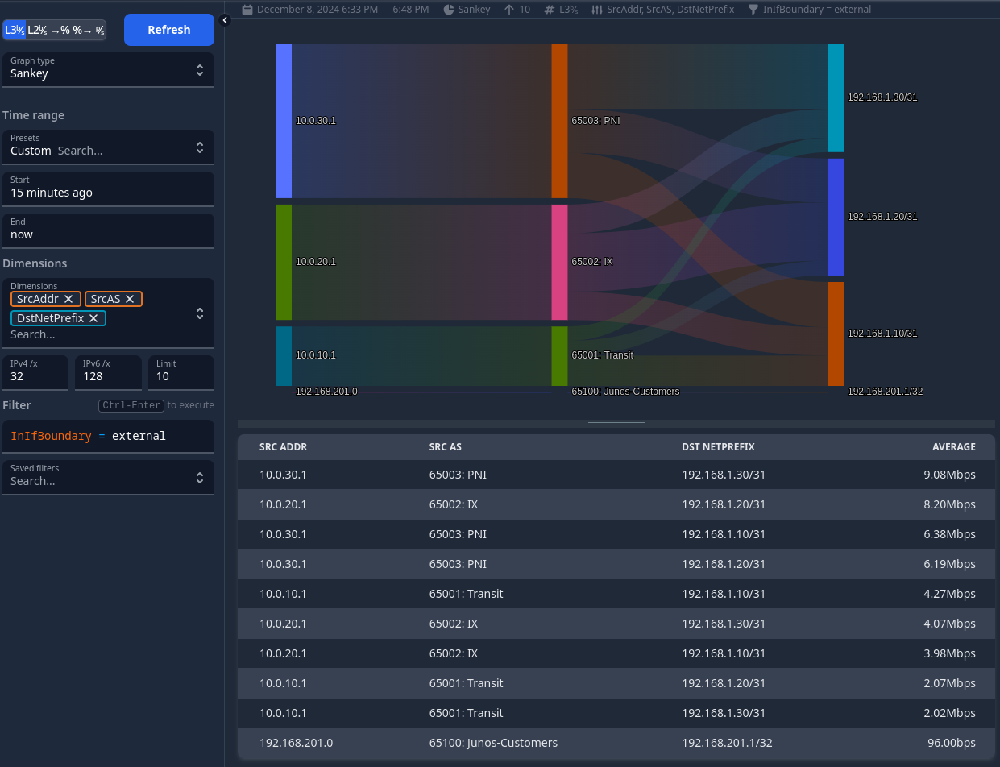

# multivendor-akvorado



A small Netflow/sFlow lab based on Juniper vJunos-router and Nokia SR Linux, capturing and visualising flows with Akvorado.

The Nokia SR Linux router uses sFlow, while the vJunos-based router uses IPFIX to export flows. A vJunos-based "peering" router connects these two routers to the iPerf3 servers via three separate links, designated Transit, IX and PNI.

Topology: 

## Prerequisites

To run this lab, you need to make sure that you can spin up Nokia SR Linux and Juniper vJunos-router nodes, as well as use an iPerf container image.

- Nokia SR Linux:  
The containerised NOS image can be freely pulled from the GitHub Container Registry. Containerlab will automatically do this for you on the first run, if you don't already have the container image locally
- Juniper vJunos-router:
You need to build a container image using the [vrnetlab](https://github.com/hellt/vrnetlab/tree/master/vjunosrouter) project, if you don't have this image locally. Follow the linked instructions, you **don't need a Juniper account** to download vJunos-router. The lab builds on top of the latest vJunos-router image.

You also need to be able to become/run this as root, this is a limitation of Containerlab.

## Starting the lab

You can start using this lab topology in four easy steps:

- Deploy the containerlab topology (`containerlab deploy`)
- Grab the Akvorado docker compose project, copy the configuration files, and deploy it:
```
mkdir ./akvorado
curl -sL https://github.com/akvorado/akvorado/releases/latest/download/docker-compose-quickstart.tar.gz | tar zxvf - -C ./akvorado
cp ./akvorado-config/.env ./akvorado/.env
cp ./akvorado-config/akvorado.yaml ./akvorado/config/akvorado.yaml
cp ./akvorado-config/inlet.yaml ./akvorado/config/inlet.yaml
cp ./akvorado-config/docker-compose-local.yml ./akvorado/docker/docker-compose-local.yml
```
- Deploy Akvorado via `docker compose`
```
cd ./akvorado
docker compose up -d
```
- Run tests from iPerf clients, `docker exec -it <client name> iperf3 -c 10.0.0.1`

The Akvorado dashboard is available at: http://172.20.22.150:8081

A convenience script, `start.sh`, will do these steps for you, and start a few test iPerf sessions, so you can start working immediately with flow data.

## Stopping the lab

You can destroy the lab topology through the usual `containerlab destroy` command, but don't forget to also remove the Akvorado installation too!
It is easiest if you first remove the Akvorado installation (`cd ./akvorado; docker compose down`), then destroy the Containerlab topology (`container destroy -t ./multivendor-akvorado.clab.yml`), to ensure all lab resources are properly removed.

`stop.sh` will do this for you.
